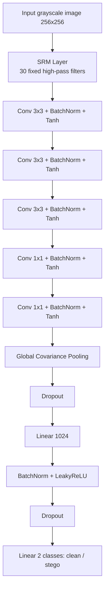
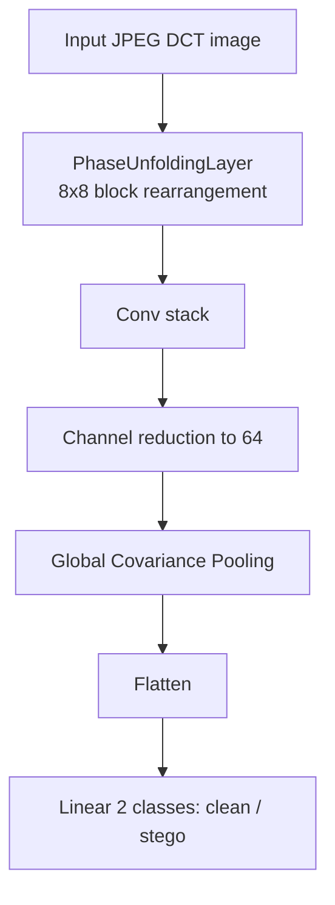

# Dead Drop Hunter

A CNN-based steganalysis system that scans images for hidden payloads before they land in production storage — designed to stop "dead drop" attacks that smuggle malicious code past enterprise firewalls.

---

## The Threat Model: Dead Drops

Modern cyberattacks frequently avoid direct injection of malicious code into a target device. Standard phishing payloads are easily flagged by email platforms and enterprise antivirus solutions using signature matching.

To bypass this, attackers utilize **dead drops**:

1. **Embedding** — Malicious code is embedded into benign-looking images using advanced steganographic algorithms (in both spatial and frequency domains).
2. **Hosting** — The image is uploaded to a public-facing S3 bucket, often the enterprise's own infrastructure.
3. **Execution** — A seemingly harmless loader script is injected into the enterprise network. Because it requests an image from an internal or trusted bucket, the firewall allows the traffic. The loader extracts the hidden payload from the dead drop image and executes the malicious code.

**The Solution:** Dead Drop Hunter mitigates this risk by scanning incoming images for hidden embeddings *before* they are stored in the bucket, classifying them as either `clean` or `steg`.

---

## The Steganalysis Approach

This model is a customized Convolutional Neural Network (CNN) that accepts 256×256 grayscale images.

Unlike standard computer vision CNNs built to recognize objects by *ignoring* tiny pixel noise, **steganalysis CNNs are built completely upside down**. Their objective is to preserve and magnify weak modifications and high-frequency noise caused by steganography.

---

## System Architecture & Pipeline

### 1. Dataset Preparation

The system utilizes images from **BOSSbase_1.01**, **NRC-BMP-1500**, and **CALTECH-BMP-1500**.

| Step | Description | Script |
|---|---|---|
| Grayscale Conversion | Converts the NRC and CALTECH datasets to grayscale | [`dataset_prep/convert_to_grayscale.py`](dataset_prep/convert_to_grayscale.py) |
| Tiling | Crops images into 256×256 tiles | [`dataset_prep/tile_dataset.py`](dataset_prep/tile_dataset.py) |
| Splitting | Splits the dataset into train/test sets | [`dataset_prep/split_test_train.py`](dataset_prep/split_test_train.py) |
| Formatting *(optional)* | Compresses tiles to PNG | [`dataset_prep/compress_tiles_to_png.py`](dataset_prep/compress_tiles_to_png.py) |
| Format Conversion | Converts BMP/PGM to JPG | [`convert_bmp_pgm_to_jpg.py`](convert_bmp_pgm_to_jpg.py) |

> **Note:** To prevent data leakage, strict separation is enforced — all tiles originating from a single parent image belong exclusively to either the train set or the test set, never both.

### 2. Dataset Synthesis (Steganography)

The dataset is embedded with random hidden values using multiple algorithms across different domains.

**Spatial Domain Algorithms** (LSB, PVD, WOW, S-UNIWARD, MiPOD)

* Managed by [`steg_img_synthesis/spatial_domain/stego_orchestrator.py`](steg_img_synthesis/spatial_domain/stego_orchestrator.py)
* Individual implementations:
  * [`stego_lsb.py`](steg_img_synthesis/spatial_domain/stego_lsb.py)
  * [`stego_pvd.py`](steg_img_synthesis/spatial_domain/stego_pvd.py)
  * [`stego_wow.py`](steg_img_synthesis/spatial_domain/stego_wow.py)
  * [`stego_suniward.py`](steg_img_synthesis/spatial_domain/stego_suniward.py)
  * [`stego_mipod.py`](steg_img_synthesis/spatial_domain/stego_mipod.py)

**Frequency Domain Algorithms** (J-UNIWARD)

* Managed by [`steg_img_synthesis/frequency_domain/stego_jpeg_orchestrator.py`](steg_img_synthesis/frequency_domain/stego_jpeg_orchestrator.py)
* Implementations:
  * [`stego_juniward.py`](steg_img_synthesis/frequency_domain/stego_juniward.py)
  * [`stego_jpeg_conseal.py`](steg_img_synthesis/frequency_domain/stego_jpeg_conseal.py)

---

## Model Architecture

The network utilizes a **Spatial Rich Model (SRM)** high-pass filter bank. 30 fixed high-pass filters convolve with the input image to isolate residuals — each output channel represents residuals computed by a different predictor.

These residual values are aggressively clamped to `[-2.0, 2.0]` to eliminate large gradients caused by natural sharp edges in the image:

```python
torch.clamp(self.conv(x), min=-2.0, max=2.0)
```

Batch Normalization is applied after every layer output to ensure gradients don't depend heavily on scale, preventing uneven learning.

Instead of standard Global Average Pooling (GAP), the model ends with **Global Covariance Pooling (GCP)**. GCP captures second-order statistics — co-occurrences and channel interactions — providing a far more expressive representation of image geometry and stego-texture.

### Spatial Domain Model

Implemented in [`training/spatial_domain/steg_train.py`](training/spatial_domain/steg_train.py). Optimizer: `AdamW`.



### Frequency Domain (JPEG) Model

Implemented in [`training/frequency_domain/nvidia_gpu_train_jpeg.py`](training/frequency_domain/nvidia_gpu_train_jpeg.py). Optimizer: `Adam`.



---

## Evaluation & Inference

The evaluation logic and live prediction flows are managed in:

* [`pred_eval/spatial_domain/eval_checkpoint.py`](pred_eval/spatial_domain/eval_checkpoint.py)
* [`pred_eval/spatial_domain/predict_stego.py`](pred_eval/spatial_domain/predict_stego.py)

**Primary metrics monitored:**

* Balanced Accuracy
* Precision & F1 Score
* Per-Algorithm Accuracy (to ensure the model doesn't overfit to a specific steganographic technique)

**Sample run (Epoch 9/10, micro-batch 8 × 4 accum steps = effective batch 32):**

```text
Training:   100%|████████████████████████████████████████| 7500/7500 [21:04<00:00,  5.93it/s, loss=0.4812]
Evaluating: 100%|████████████████████████████████████████| 2300/2300 [01:57<00:00, 19.62it/s]
=============================================
 OVERALL BALANCED ACCURACY: 75.70%
 F1 Score:                  77.00%
 Precision:                 73.08%
---------------------------------------------
 Clean Accuracy (Specificity): 70.03%  [6443/9200]
 Stego Accuracy (Sensitivity): 81.36%  [7485/9200]
---------------------------------------------
   ├── LSB         accuracy:   95.00%  [1748/1840]
   ├── PVD         accuracy:   99.40%  [1829/1840]
   ├── WOW         accuracy:   71.85%  [1322/1840]
   ├── S-UNIWARD   accuracy:   73.97%  [1361/1840]
   ├── MiPOD       accuracy:   66.58%  [1225/1840]
=============================================
```

---

## Setup & Installation

Clone the repository and install the required dependencies:

```bash
git clone https://github.com/nitilvijay/dead_drop_hunter.git
cd dead_drop_hunter
pip install -r requirements.txt
```

**Core Dependencies:**

* `torch`
* `numpy`
* `Pillow`
* `scikit-learn`
* `tqdm`
* `jpeglib`
* `conseal`
