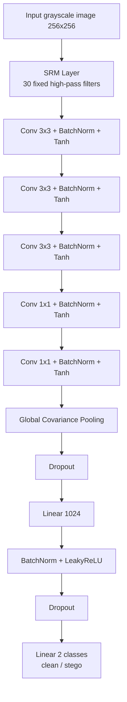
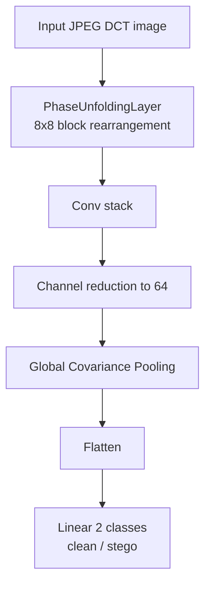

# Dead Drop Hunter

## Overview
Modern attacks such as this do not involve direct injection of malicious code into the subject's device. Even if the attacker tries to inject something through a phishing email, the malware will be flagged by the email platform or the system antivirus using techniques like signature matching.

How do attackers make use of the dead drops?

Attackers embed the malicious code into images using advanced steganographic algorithms. The embeddings can be in the spatial domain or in the frequency domain.

The image is then uploaded to a public facing S3 bucket, mostly the enterprise's own bucket which provides certain service.

This image is the dead drop. At this time, the image does no harm.

The attacker then injects a loader script into a device part of the enterprise's network. This script is not flagged as it is not malicious on its own.

This loader script downloads the image from the bucket. Conveniently this is not blocked by the enterprise's firewall as it is from the enterprise's own maintained bucket.

The loader knows how to extract the hidden code from the image, which then executes the malicious code.

The risk this kind of attack can be reduced if the incoming images to the bucket are scanned for embeddings. This model's main objective is to scan for any hidden embeddings in the incoming image and flag them as clean or steg. This process happens before the image is stored.

## Model
This model is an implementation of CNN which accepts grayscale images of 256x256 dimension. However this does not follow the usual preprocessing and architecture of spatial based image classification.

Standard CNNs are built to recognize objects, so they try to ignore tiny pixel noises. Steganalysis CNNs are built completely upside down to do the exact opposite: preserve and magnify weak modifications.

## System Architecture

### Dataset used
BOSSbase_1.01, NRC-BMP-1500, CALTECH-BMP-1500. The latter two image datasets are converted to grayscale with [dataset_prep/convert_to_grayscale.py](dataset_prep/convert_to_grayscale.py).

### Dataset preparation
All the images are cropped into smaller tiles of dimension 256x256 with [dataset_prep/tile_dataset.py](dataset_prep/tile_dataset.py).

Then the images are split into test and train with [dataset_prep/split_test_train.py](dataset_prep/split_test_train.py).

Important point to note: all tiles from an image should be either in test or train. Some cannot be in train and the others in test.

If needed, the tiles can also be converted to PNG with [dataset_prep/compress_tiles_to_png.py](dataset_prep/compress_tiles_to_png.py), and the top-level converter [convert_bmp_pgm_to_jpg.py](convert_bmp_pgm_to_jpg.py) can be used for BMP/PGM to JPG conversion.

### Dataset synthesis (Image steganography synthesis)
Embed the dataset with random values using the respective algo.

Algo used:

- Spatial domain - LSB, PVD, WOW, S-UNIWARD, MiPOD
- Frequency domain - J-UNIWARD

Relevant code files:

- [steg_img_synthesis/spatial_domain/stego_orchestrator.py](steg_img_synthesis/spatial_domain/stego_orchestrator.py)
- [steg_img_synthesis/spatial_domain/stego_lsb.py](steg_img_synthesis/spatial_domain/stego_lsb.py)
- [steg_img_synthesis/spatial_domain/stego_pvd.py](steg_img_synthesis/spatial_domain/stego_pvd.py)
- [steg_img_synthesis/spatial_domain/stego_wow.py](steg_img_synthesis/spatial_domain/stego_wow.py)
- [steg_img_synthesis/spatial_domain/stego_suniward.py](steg_img_synthesis/spatial_domain/stego_suniward.py)
- [steg_img_synthesis/spatial_domain/stego_mipod.py](steg_img_synthesis/spatial_domain/stego_mipod.py)
- [steg_img_synthesis/frequency_domain/stego_jpeg_orchestrator.py](steg_img_synthesis/frequency_domain/stego_jpeg_orchestrator.py)
- [steg_img_synthesis/frequency_domain/stego_juniward.py](steg_img_synthesis/frequency_domain/stego_juniward.py)
- [steg_img_synthesis/frequency_domain/stego_jpeg_conseal.py](steg_img_synthesis/frequency_domain/stego_jpeg_conseal.py)

## Model Architecture
SRM - High pass filters.

30 different high pass filters convolve with the image using `nn.Conv2d(1, 30, kernel_size=5, padding=2)` to result in channels of residual.

Every channel represents residuals computed by a different predictor.

These residual values are truncated, clipped to [-2, 2], to avoid the large residuals which have resulted due to the sharp edges in the device.

```python
torch.clamp(self.conv(x), min=-2.0, max=2.0)
```

The main spatial-domain model is implemented in [training/spatial_domain/steg_train.py](training/spatial_domain/steg_train.py).

Batch Normalization takes place after every layer output, similar to the standard normalization we do before input to the first layer.

Gradients depend on scale. If scales differ, learning becomes uneven and inefficient.

Global Covariance Pooling occurs at the last layer.

While Global Average Pooling (GAP) is the standard industry go-to, Global Covariance Pooling (GCP) is a more advanced alternative designed to capture richer, higher-order statistical relationships.

Second-order statistics: it captures the co-occurrence and correlations of different features. Channel interaction: it explicitly models the relationships between different channels, providing a far more expressive representation of the image geometry and texture.

The frequency-domain model is implemented in [training/frequency_domain/nvidia_gpu_train_jpeg.py](training/frequency_domain/nvidia_gpu_train_jpeg.py).

### Visual flow for the spatial model



### Visual flow for the JPEG model



## Optimizer and metrics
Optimizer used is AdamW for the spatial-domain model, and Adam for the JPEG model.

Metrics used for evaluation:

- Balanced Accuracy
- Precision
- F1 Score
- Per-Algorithm Accuracy

The evaluation and prediction flow is implemented in [pred_eval/spatial_domain/predict_stego.py](pred_eval/spatial_domain/predict_stego.py) and [pred_eval/spatial_domain/eval_checkpoint.py](pred_eval/spatial_domain/eval_checkpoint.py).

## Requirements
The Python dependencies are listed in [requirements.txt](requirements.txt).

Install them with:

```bash
pip install -r requirements.txt
```

Packages used:

- numpy
- Pillow
- scikit-learn
- tqdm
- torch
- jpeglib
- conseal

## Sample training output
```text
Epoch 13/13 (micro-batch 8 x 4 accum steps = effective batch 32)
Training: 100%|██████████████████████████████████████████████████████████████████████████████████| 7500/7500 [20:58<00:00,  5.96it/s, loss=0.4764]
Evaluating: 100%|█████████████████████████████████████████████████████████████████████████████████████████████| 2300/2300 [01:52<00:00, 20.42it/s]

=============================================
 OVERALL BALANCED ACCURACY: 76.69%
 F1 Score:                  77.15%
 Precision:                 75.66%
---------------------------------------------
 Clean Accuracy (Specificity): 74.67%  [6870/9200]
 Stego Accuracy (Sensitivity): 78.71%  [7241/9200]
---------------------------------------------
   ├── LSB         accuracy:   90.22%  [1660/1840]
   ├── PVD         accuracy:   98.91%  [1820/1840]
   ├── WOW         accuracy:   68.42%  [1259/1840]
   ├── S-UNIWARD   accuracy:   69.84%  [1285/1840]
   ├── MiPOD       accuracy:   66.14%  [1217/1840]
=============================================
```
